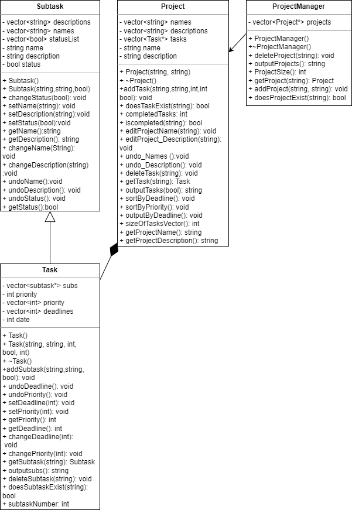

# Task Scheduler
 
 > Authors: [Abel Challa](https://github.com/abelchalla), [Ethan Lingad](https://github.com/EthanL0224), [Anjali Daryani](https://github.com/adary001), [Siyu Li](https://github.com/slialex)

> ### Project Description
> * Description: In this application, a user can create tasks including a title, description,
classification (e.g. personal, work, study), priority, duration and due date. Some of these
features can also be optional. Users can also create task lists where each list includes
multiple tasks. Task lists can represent larger tasks that have subtasks within them.
Users can display, edit, and delete tasks and task lists. Users should also be able to
undo these operations. 

> ### Important or interesting to us
> * As a college student there are many assignments and projects every week. To complete these assignments efficiently and on time, we need to have a proper planning for these projects. Therefore, a task scheduler is necessary for us. This application can help us to schedule our time properly. This way, we can avoid missing or not being able to finish our assignments due to lack of time. It also helps us to prioritize our assignments according to their complexity and deadline, so that we don't have too many assignments to start with.

> ### Tools and Languages
> * C++ - Programming Language Used
> * Github - Tool used for host of remote repository
> * CMake - Tool used to compile and run code
> * Googletest - Tool for writing and running unit tests
> * Make - Tool to build executables 
> * Draw.io - Tool used to make UML diagrams
> * Valgrind - Tool used for memory access error and leak detections

> ### Inputs:
>Creating a new task: The task's title, description, categorization, priority, duration, and due date would all be values that the user would supply. Some of these parameters might not be required.
Creating a new task list: The task list would be given a name by the user.
Adding a task to a task list: The task and task list would be specified by the user.
Removing a task from a task list: The task and task list to be removed from would be specified by the user.
Editing a task: The job to update and the new values for its characteristics would be specified by the user.
Deleting a task: The job to remove would be specified by the user.
Displaying a task list: The task list to display would be chosen by the user.
Undoing an operation: The action to undo would be specified by the user.

> ### Outputs:
>The task lists and their tasks would be displayed as the application's outputs. The application might, for instance, output the name of the task list together with the title, description, classification, priority, duration, and due date of each item in the list when showing a task list. In addition, the program would provide any necessary confirmations or error messages, such as "Task successfully added to task list."

> ### Features
> * The user of the program will be able to enter subtasks integrated inside of the task. As an example, if the user creates a task that's called "Clean Kitchen", then the user can also create subtasks within that task such as "Wash Dishes", "Take Out Trash", "Clean Out Refrigerator", or "Wipe Counters". Users will be prompted to enter the name of the task, a description of the task, the status of the task, and the deadline for the task. Users can prioritize tasks by ranking them in order of importance. Depending on each task's priority, the program would output the tasks in a particular format. The user can evaluate whether task is more significant than the other by viewing it in a specific manner. Users can be able to edit and delete tasks. The user has the flexibility to alter the name, description, due date, and status whenever they want. A user has the option to delete a task if they decide they no longer want it to be visible. Users have the option to undo their activity if they accidentally edit tasks in the wrong way. The user won't have to delete and start a brand-new task as a result.

## Class Diagram
 
 > There are five classes in our class diagram. The subtask and Task classes will inherit the traits from the Basic class. A name, description, and status are frequent characteristics shared by subtasks and tasks. As a class job is more significant than a subtask, it has the priority and deadline that a subtask does not. There is a compositional link between the Task class and the vector that stores its many subtasks. In case the user wants to combine tasks together and have subtasks inside them, the class Project is another one that will contain a vector that keeps several tasks in one location. If the user wants to create several projects, it helps arrange the number of them. The single responsibility concept, another SOLID element, was added to our project. The user interface is solely the responsibility of our main file, which will also output all content to the terminal. However, while our ProjectManager class is designed to manage several projects, it also functions as a single responsibility job. Liskov's Substitution Principle is another SOLID concept that we have included into our software. Any child class, such as our Task class, will inherit the same qualities and characteristics from our Subtask class, which acts as a base class. The Liskov Substitution Principle (LSP) is the idea that objects from a superclass should be able to be substituted with objects from its subclasses without the application being broken. In other words, our goal is to have our subclass objects behave identically to our superclass objects, which is what our subtask and task are doing.
 
 > ## Phase III
 > You will need to schedule a check-in for the second scrum meeting with the same reader you had your first scrum meeting with (using Calendly). Your entire team must be present. This meeting will occur on week 8 during lab time.
 
 > BEFORE the meeting you should do the following:
 > * Update your class diagram from Phase II to include any feedback you received from your TA/grader.
 > * Considering the SOLID design principles, reflect back on your class diagram and think about how you can use the SOLID principles to improve your design. You should then update the README.md file by adding the following:
 >   * A new class diagram incorporating your changes after considering the SOLID principles.
 >   * For each update in your class diagram, you must explain in 3-4 sentences:
 >     * What SOLID principle(s) did you apply?
 >     * How did you apply it? i.e. describe the change.
 >     * How did this change help you write better code?
 > * Perform a new sprint plan like you did in Phase II.
 > * You should also make sure that your README file (and Project board) are up-to-date reflecting the current status of your project and the most recent class diagram. Previous versions of the README file should still be visible through your commit history.
 
> During the meeting with your reader you will discuss: 
 > * How effective your last sprint was (each member should talk about what they did)
 > * Any tasks that did not get completed last sprint, and how you took them into consideration for this sprint
 > * Any bugs you've identified and created issues for during the sprint. Do you plan on fixing them in the next sprint or are they lower priority?
 > * What tasks you are planning for this next sprint.

 
 > ## Final deliverable
 > All group members will give a demo to the reader during lab time. ou should schedule your demo on Calendly with the same reader who took your second scrum meeting. The reader will check the demo and the project GitHub repository and ask a few questions to all the team members. 
 > Before the demo, you should do the following:
 > * Complete the sections below (i.e. Screenshots, Installation/Usage, Testing)
 > * Plan one more sprint (that you will not necessarily complete before the end of the quarter). Your In-progress and In-testing columns should be empty (you are not doing more work currently) but your TODO column should have a full sprint plan in it as you have done before. This should include any known bugs (there should be some) or new features you would like to add. These should appear as issues/cards on your Project board.
 > * Make sure your README file and Project board are up-to-date reflecting the current status of your project (e.g. any changes that you have made during the project such as changes to your class diagram). Previous versions should still be visible through your commit history. 
 
 ## Screenshots
 > Screenshots of the input/output after running your application
 > 
 > 
 > 
 > A
 > 
 > When the user picks A, the user is prompted to enter values for the Project name and description. Then the Project Menu appears for further options.
 > O
 > 
 > When the user selects O, the program retrieves all the existing projects from the project inventory and displays them to the user. The specific implementation of how the projects are displayed will depend on the design of the program, but one possible way to do it is to print out a list of all the projects with their names and descriptions,  After displaying the list of projects, the program could return the user to the Project Menu to allow them to choose another option.
> D
> 
> When the user selects this option, the program prompts the user to enter the name of the project they want to delete. The program then searches the project inventory for a project with that name and, if it is found, deletes it from the inventory. The program then returns them to the Project Menu.
>S
>
> When the user selects this option, the program retrieves the number of projects in the inventory and displays it to the user. The program then returns the user to the Project Menu.
>E
>
>When the user selects this option, the program prompts the user to enter the name of the project they want to edit or inspect. The program then searches the project inventory for a project with that name and, if it is found, displays the project information to the user. The program then presents the Project Edit Menu, which allows the user to edit or delete the project, add tasks to the project, go back to the main Project Menu and more.

 ## Installation/Usage
 > Instructions on installing and running your application
 ## Testing
 > How was your project tested/validated?
 
Our project was tested using the Google Test framework. The tests are testing classes and their methods, including the Task, Subtask, Project, and ProjectManager classes. The tests are checking that the methods of these classes are functioning correctly and producing the expected outputs.

We also tested our project using Valgrind for memory debugging, leak detection, and profiling. The Makefile compiles all the necessary source files and links them together to create an executable named "runAllFiles" which is then run under the Valgrind tool.
